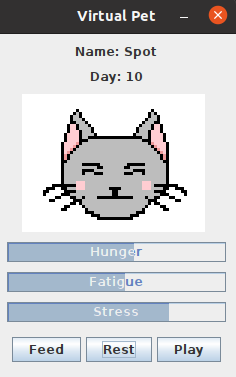

# Java Virtual Pet

A simple virtual pet simulation using the Java swing library. Pet hunger, fatigue, and stress "health" attributes can be fulfilled by the corresponding feed, rest, and play buttons.

The simulation acts as a server (ZMQ Request-Reply messaging pattern) to send pet state information or execute the feed, rest, and play actions.

Requires: Java 8

